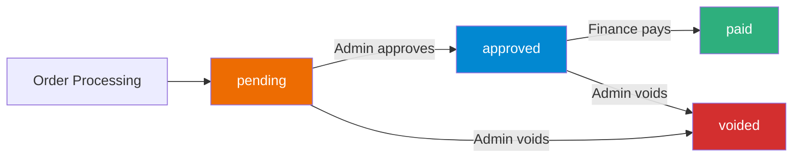
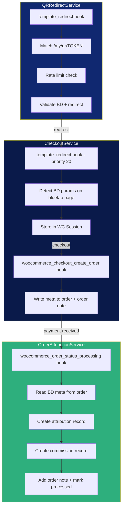

# QR Code → Order Attribution Flow

## Customer Journey

```mermaid
flowchart TD
    A[🔲 Customer scans BD's QR Code] --> B[GET /my/qr/BD_TOKEN]

    B --> C{Rate Limit Check<br/>5 req/hr per IP}
    C -->|Blocked| D[❌ 429 Too Many Requests]
    C -->|Allowed| E{Validate BD Token}

    E -->|Invalid/Inactive| F[❌ 404 Invalid QR Code]
    E -->|Valid| G[🔄 Redirect to /my/bluetap/<br/>with BD params in URL]

    G --> H[CheckoutService intercepts<br/>on bluetap page]

    H --> I[1. Empty cart]
    I --> J[2. Add BlueTap product to cart]
    J --> K[3. Store BD data in WC Session<br/>- bd_tracking_code<br/>- bd_user_id<br/>- reseller_id<br/>- UTM params]
    K --> L[4. Redirect to /my/checkout/]

    L --> M[📝 Customer fills checkout form<br/>Name, Email, Phone, Payment<br/>No coupon visible]

    M --> N[Customer completes purchase]

    N --> O[Hook: woocommerce_checkout_create_order]
    O --> P[CheckoutService reads WC Session<br/>Writes BD meta to order:<br/>- _bd_coupon_code<br/>- _bd_user_id<br/>- _reseller_id<br/>- _attribution_status<br/>- UTM params]
    P --> Q[📝 Add Order Note:<br/>BD Attribution info]
    Q --> R[Clear WC Session data]

    R --> S[Order created with status: pending]
    S --> T[Payment processed<br/>DuitNow / TNG / Alipay+]
    T --> U[Order status → processing]

    U --> V[Hook: woocommerce_order_status_processing]
    V --> W{Already processed?<br/>Check _epos_attribution_processed}

    W -->|Yes| X[⏭️ Skip - no duplicate]
    W -->|No| Y{Has BD meta?<br/>_bd_coupon_code + _bd_user_id}

    Y -->|No| Z[⏭️ Normal order - not BD attributed]
    Y -->|Yes| AA[Find BD record by user ID]

    AA --> AB{BD found?}
    AB -->|No| AC[⚠️ Log error + Order note:<br/>BD not found]
    AB -->|Yes| AD[Calculate order value<br/>Net = Total - Tax - Shipping]

    AD --> AE[Create OrderAttribution record<br/>order_id, bd_id, reseller_id,<br/>tracking_code, order_value]

    AE --> AF[Calculate commission<br/>Amount = Net × Rate%]
    AF --> AG[Create Commission record<br/>type: sales, status: pending]

    AG --> AH[📝 Add Order Note:<br/>Commission details]
    AH --> AI[Mark _epos_attribution_processed = 1]
    AI --> AJ[✅ Attribution complete]

    style A fill:#102870,color:#fff
    style D fill:#D32F2F,color:#fff
    style F fill:#D32F2F,color:#fff
    style AC fill:#ED6C02,color:#fff
    style AJ fill:#2EAF7D,color:#fff
    style M fill:#f5f6fa,color:#1a1a2e
    style X fill:#717171,color:#fff
    style Z fill:#717171,color:#fff
```

## Commission Lifecycle

## Key Services & Hooks

## Data Storage Points

| Stage | Where | What |
|-------|-------|------|
| QR Scan | URL params | `bd_tracking`, `bd_user_id`, `reseller_id`, UTM |
| Bluetap Page | WC Session | `epos_bd_tracking_code`, `epos_bd_user_id`, `epos_reseller_id`, `epos_utm_*` |
| Order Created | Order Meta | `_bd_coupon_code`, `_bd_user_id`, `_reseller_id`, `_attribution_*` |
| Order Processing | `epos_order_attributions` table | `order_id`, `bd_id`, `reseller_id`, `order_value` |
| Order Processing | `epos_commissions` table | `bd_id`, `type: sales`, `amount`, `status: pending` |
| Order Notes | WC Order Notes | BD attribution info + commission details |

## Logging

All logs written to WooCommerce logs (`wc-logs/epos-affiliate-*.log`) via `Logger` class:

| Context | Log Level | When |
|---------|-----------|------|
| `[QR]` | info | QR scan received, valid BD found |
| `[QR]` | warning | Rate limited, invalid/inactive BD |
| `[Checkout]` | info | BD redirect, cart prepared, session stored, meta written |
| `[Attribution]` | info | Order processing, value calculation, records created |
| `[Attribution]` | error | BD not found, order not found |
